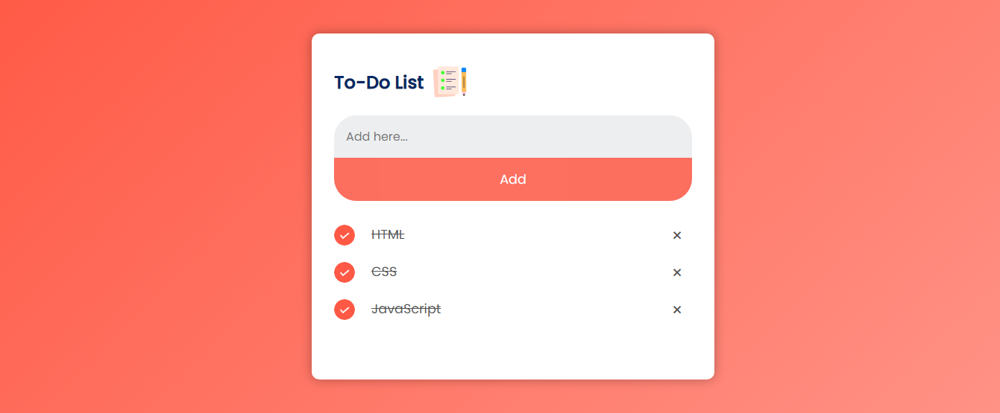

# To-Do List App
 To Do List App

 

## 🖥️ O Projeto
Este é um projeto básico aplicado HTML + CSS + JS para incluir uma lista de afazeres.
 
 

## 🚀 Tecnologias
Esse protótipo foi desenvolvido com as seguintes tecnologias:

- HTML5
- CSS3
- JS
- Git e Github